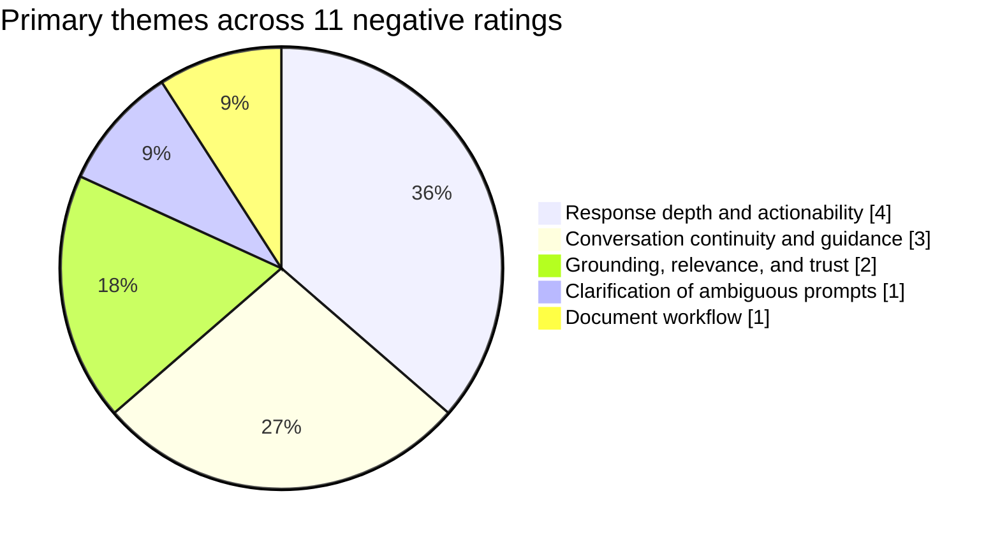
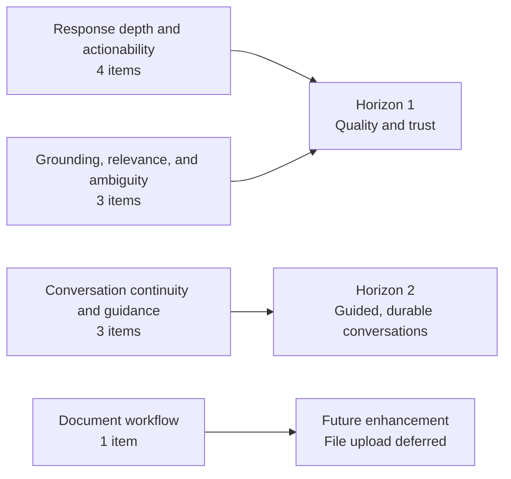

# 30-Day Negative Feedback Summary

## Executive summary

The strongest signal is not an operational failure. Negatively rated turns
generally completed normally and retrieved Knowledge Source material, but the
resulting answers did not consistently match the tester's desired depth,
clarity, or level of certainty.

The most frequent need is a concise, actionable first response that can deepen
progressively. Other recurring needs are visible conversation continuity,
guided starting points, supported follow-up questions, and stricter evidence
boundaries for ALO-specific claims. One report requested document upload; that
capability has been deferred as a future enhancement.

The recommended evolution remains quality and trust first, followed by guided,
durable conversations.

## Evidence snapshot

| Measure | Result |
|---|---:|
| Active testers | 6 |
| Active chat sessions | 11 |
| Assistant answers | 60 |
| Submitted ratings | 13 |
| Negative ratings | 11 |
| Positive ratings | 2 |
| Sessions represented by negative feedback | 5 |
| Negative ratings with written comments | 6 |
| Negative ratings with selected categories | 4 |

Additional observations:

- Negative ratings represented 18.3% of assistant answers during the evidence
  window. Because ratings are optional and self-selected, this is a directional
  signal rather than a population dissatisfaction rate.
- Ten of the eleven negatively rated turns performed a Knowledge Source
  retrieval. All ten retrievals completed and returned sources.
- Negatively rated answers averaged approximately 3,278 characters, compared
  with 2,281 characters across all assistant answers. The sample is too small
  to treat length alone as a predictor of satisfaction.

## Major themes

Each negative item was assigned one primary theme to avoid double counting.
Some items also contained secondary signals.

| Primary theme | Items | High-level interpretation |
|---|---:|---|
| Response depth and actionability | 4 | Answers were too complex, insufficiently actionable, or failed to adapt to requests for a simpler starting point. |
| Conversation continuity and guidance | 3 | Testers wanted visible history, guided starter topics, and suggested next questions. |
| Grounding, relevance, and trust | 2 | Answers raised concerns about topical relevance, freshness, or unsupported organization-specific assertions. |
| Clarification of ambiguous prompts | 1 | A short or unclear prompt received a confident answer instead of a clarifying question. |
| Document workflow | 1 | A tester requested document review through file upload. |

### Response depth and actionability

The assistant often produced a complete framework when the tester needed a
small starting point. The desired behavior is a direct answer, no more than
three initial actions, and an invitation to go deeper.

### Grounding, relevance, and trust

Successful retrieval did not guarantee a trustworthy synthesis. ALO-specific
facts—especially policy, licensing, governance, and intellectual-property
claims—need precise citations to the supporting read-only Google Knowledge
Source. Missing or conflicting evidence should trigger clarification or a
clearly stated limitation.

### Conversation continuity and guidance

The blank chat surface did not communicate the assistant's supported domain or
help testers continue a useful journey. The requested experience includes
durable conversation history, administrator-curated starter journeys, and
constrained follow-up suggestions grounded in the current conversation and its
cited sources.

### Clarification and document workflow

Ambiguous prompts should produce one clarifying question rather than a
speculative answer. File upload represents a distinct document-review workflow
with privacy and retention implications and remains outside the current
evolution.

## Visualizations

The chart below shows the mutually exclusive primary-theme classification used
for this summary.

The second view connects the feedback themes to the agreed evolution sequence.

## Product implications

1. Make the first response concise and progressive: target 120–180 words,
   provide no more than three actions, and expand when requested.
2. Require precise, claim-level links to read-only Google Knowledge Sources for
   ALO-specific facts; clarify or decline when evidence is insufficient.
3. Support durable, account-owned conversations, administrator-curated starter
   journeys, and constrained tester-reviewed follow-up suggestions.

## Limitations and caveats

- The sample contains only 13 submitted ratings and 11 negative ratings.
- Rating is optional, so submitted feedback may overrepresent dissatisfied or
  highly engaged testers.
- Several negative ratings lacked a category or written explanation. Their
  primary themes were inferred from privacy-redacted replay evidence.
- Theme assignment is an analytical classification, not the application's
  stored feedback taxonomy.
- Retrieval success confirms that the tool returned sources; it does not prove
  source relevance, faithful synthesis, or claim accuracy.
- The feedback record exposes creation time but not a separate timestamp for a
  later vote change, so the evidence window uses the available creation time.

## Related artifacts

- [Webchat Evolution Brief: 30-Day Negative Feedback](https://github.com/letsconfab/template-webchat/blob/main/docs/evolution/2026-07-27-negative-feedback-evolution.md)
