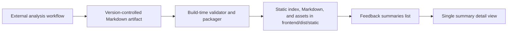

# Plan: Static 30-Day Negative-Feedback Summary

- **Date:** 2026-07-28
- **Status:** Ready for implementation; grilling complete
- **Target surface:** `/admin/feedback`
- **Related evolution:** [30-Day Negative Feedback Evolution](../evolution/2026-07-27-negative-feedback-evolution.md)

## Goal

Display a version-controlled, static summary of the previously analyzed
negative feedback from the preceding 30 days at the top of the administrator
Feedback Case list. The summary may include optional visualizations.

This plan incorporates the decisions resolved through a
one-question-at-a-time grilling session.

## Confirmed decisions

### Decision 1: Author outside the application runtime

Status: Accepted on 2026-07-28

The summary artifact is authored outside the deployed server runtime, currently
using the maintainer's Codex-enabled ChatGPT 5.6 Sol workflow at or around build
time.

The artifact will:

- use a portable, human-readable format;
- live under version control alongside evolution, ADR, field-debug, and HITL
  cognition artifacts;
- be reviewed through the normal repository change workflow;
- be packaged for the frontend at build time; and
- be rendered as static content at the top of the `/admin/feedback` list page.

The current feature will not:

- invoke an LLM from the deployed application;
- query and analyze production feedback during page load;
- store the summary in the application database; or
- implement a runtime draft, review, or publish workflow.

A server-side **Generate Summary** workflow remains a future enhancement.

### Decision 2: Use Markdown with YAML front matter

Status: Accepted on 2026-07-28

Each summary is a portable Markdown document stored under:

```text
docs/feedback-summaries/
```

The filename convention is:

```text
YYYY-MM-DD-negative-feedback-30d.md
```

The YAML front matter contains the artifact schema version, stable artifact ID,
title, generation timestamp, exact evidence-window start and end, and authoring
model or workflow. The body contains ordinary Markdown.

Optional visualizations use:

- Mermaid fenced blocks for portable diagrams; or
- relative SVG/PNG assets stored beside the Markdown artifact.

Any frontend-specific representation is derived during the build. Generated
frontend data is not canonical and is not edited by hand.

### Decision 3: Discover and list every checked-in summary

Status: Accepted on 2026-07-28

There is no `current` publication manifest. During the frontend build, the
artifact packager discovers every valid Markdown file under
`docs/feedback-summaries/` and creates a static summary index.

The `/admin/feedback` list view displays links to all packaged summaries from
most to least recent. Selecting a link opens and renders exactly one summary on
an admin-only route such as:

```text
/admin/feedback/summaries/:artifactId
```

This route is distinct from the existing Feedback Case detail route. Adding a
valid artifact to the directory and shipping a frontend build is the
publication action; removing an artifact from a later build removes it from the
list without deleting its Git history.

Summary links are ordered primarily by the YAML front matter's evidence-window
end timestamp, descending. Generation timestamp is the deterministic
tie-breaker. Regenerating an older evidence window therefore does not make it
appear newer than a summary of more recent feedback.

### Decision 4: Require a minimum metadata and content schema

Status: Accepted on 2026-07-28

Required YAML front matter:

```yaml
schema_version: 1
artifact_id: <stable-kebab-case-id>
title: <human-readable title>
generated_at: <ISO-8601 UTC timestamp>
window_start: <ISO-8601 UTC timestamp>
window_end: <ISO-8601 UTC timestamp>
authoring_workflow: <model/tool and review workflow>
privacy_reviewed: true
```

Required body sections:

1. `## Executive summary`
2. `## Evidence snapshot`
3. `## Major themes`
4. `## Limitations and caveats`

Optional sections include:

- visualizations;
- an anonymized feedback inventory;
- product implications; and
- links to related evolution documents, ADRs, or plans.

The build validates the required front matter and headings, then preserves the
remaining authored Markdown rather than forcing the analysis into an
application-specific content model.

### Decision 5: Require public-repository-safe content

Status: Accepted on 2026-07-28

The canonical artifact must be safe to expose through the public repository,
regardless of the fact that the application renders it on an administrator-only
route.

Permitted content includes aggregate statistics, paraphrased themes, and
sanitized analysis. The artifact must not contain:

- raw or near-verbatim tester comments, prompts, or answers;
- names, email addresses (including masked addresses), or other account
  identifiers;
- user, Chat Session, Feedback Case, or message identifiers;
- per-tester breakdowns;
- links to production Feedback Cases or other private operational records; or
- secrets and deployment-specific connection details.

A bounded sanitized excerpt is permitted only when indispensable and explicitly
approved during human privacy review.

Every artifact declares `privacy_reviewed: true` in its front matter. The build
runs best-effort checks for likely emails, UUIDs, secrets, and other prohibited
identifiers, but automation does not replace human review. Git review is the
final publication gate.

### Decision 6: Show a summary library above the Feedback Case list

Status: Accepted on 2026-07-28

On the `/admin/feedback` list view, a **Feedback summaries** card appears above
the existing filters and Feedback Case list. It lists every packaged artifact
with:

- title;
- evidence-window start and end dates; and
- generation date.

The list does not embed report previews. Selecting an entry navigates to:

```text
/admin/feedback/summaries/:artifactId
```

The detail view uses the existing `AdminLayout` and shared `Markdown` renderer
to display metadata, Markdown, Mermaid diagrams, and relative images. It
includes a breadcrumb back to the Feedback Case list. Summary content is not
shown on individual Feedback Case detail pages.

### Decision 7: Fail the build for invalid artifacts and support an empty library

Status: Accepted on 2026-07-28

When `docs/feedback-summaries/` contains no artifacts, the frontend build
succeeds and the summary card displays:

> No feedback summaries available.

If any discovered artifact has invalid metadata, a duplicate artifact ID,
missing required sections, a failed automated privacy check, or a missing
referenced asset, the frontend build fails with file-specific errors. Invalid
artifacts are never silently omitted.

An unknown summary URL renders an admin-layout **Summary not found** state with
a return link. A Mermaid rendering failure uses the shared renderer's readable
source fallback and does not break the report.

### Decision 8: Require build, UI, artifact, and manual acceptance evidence

Status: Accepted on 2026-07-28

The feature is complete when:

- packager tests cover discovery, schema validation, privacy checks, duplicate
  IDs, asset validation, and evidence-window sorting;
- frontend tests cover the summary list, newest-first order, detail navigation,
  metadata, Markdown and visual rendering, empty state, and not-found state;
- a production frontend build contains the packaged index, Markdown, and
  referenced assets;
- the already-analyzed 30-day feedback is included as the first checked-in
  summary artifact;
- a manual administrator smoke test verifies list and detail behavior without
  disturbing Feedback Case filtering or review; and
- inspection confirms there are no database migrations, runtime LLM calls, or
  new feedback-analysis endpoints.

## Existing implementation context

- `AdminFeedbackCasesPage` currently renders filters followed by the Feedback
  Case list and has no summary slot.
- The existing admin analytics endpoint exposes feedback totals and usage
  buckets, but not qualitative feedback themes.
- The shared `Markdown` component safely renders GitHub-flavored Markdown,
  Knowledge Source links, and Mermaid fenced blocks with an accessible fallback.
- Recharts is already available for application-native charts.
- Production serves a locally built frontend bundle, so any artifact packaging
  must be part of the frontend build and deployment flow.
- The backend already serves `frontend/dist/static/` when that directory exists.
- The current manual frontend deployment copies `index.html` and `assets/`, but
  not `static/`; the deployment runbook must therefore be amended.
- The Docker frontend stage currently copies only `frontend/`, so it must also
  receive the canonical `docs/feedback-summaries/` source before running the
  build.

## Grilling outcome

1. **Resolved:** Markdown with YAML front matter under
   `docs/feedback-summaries/`, with Mermaid or relative SVG/PNG visuals.
2. **Resolved:** The build discovers all valid summary artifacts. The admin
   page lists them newest-first and each opens on its own summary detail route.
3. **Resolved:** Each artifact has a small required front matter and body
   schema, with optional visualizations, inventory, implications, and related
   documents.
4. **Resolved:** Artifacts must be safe for a public repository, contain no
   tester or production identifiers, pass automated checks, and declare human
   privacy review.
5. **Resolved:** A compact summary library appears above the Feedback Case
   controls; each entry opens a dedicated admin-only Markdown detail route.
6. **Resolved:** No artifacts produces a safe empty state; any invalid
   discovered artifact fails the build; unknown routes and Mermaid failures
   degrade safely.
7. **Resolved:** Completion requires packager and UI tests, a verified
   production build, the initial real artifact, an administrator smoke test,
   and confirmation that runtime analysis and persistence were not introduced.

## Architecture

The repository artifact is canonical. Everything presented in the application
is derived from it during the frontend build.



There is no backend analysis service, summary API, database table, scheduled
job, or runtime model dependency.

## Canonical artifact contract

### Directory layout

```text
docs/feedback-summaries/
├── README.md
├── 2026-07-27-negative-feedback-30d.md
└── assets/
    └── 2026-07-27-negative-feedback-30d/
        └── optional-visual.svg
```

`README.md` documents the schema, authoring workflow, privacy checklist, and
local validation command. Discovery includes only files matching
`YYYY-MM-DD-negative-feedback-30d.md`.

### Metadata validation

The packager validates:

- `schema_version` is the supported integer version;
- `artifact_id` is unique and contains only safe kebab-case characters;
- title and authoring workflow are non-empty and length-bounded;
- timestamps are valid UTC ISO-8601 values;
- `window_start` precedes `window_end` and spans the declared 30-day period;
- sorting uses `window_end`, then `generated_at`, descending;
- `privacy_reviewed` is exactly `true`; and
- all required level-two headings occur exactly once.

### Markdown and asset validation

- Raw HTML is rejected; the canonical artifact uses Markdown only.
- Mermaid fences are allowed and retain the existing strict client-side
  rendering and source fallback.
- Images must be relative artifact assets with `.svg` or `.png` extensions.
- Asset paths must remain within `docs/feedback-summaries/`, exist, and use
  case-sensitive names.
- Remote images, absolute filesystem paths, and path traversal are rejected.
- SVG assets are checked for scripts, event-handler attributes,
  `foreignObject`, and external references.
- Ordinary links may use HTTPS or in-document anchors. Repository-document
  references displayed in the application should use a browser-accessible
  repository URL rather than a local filesystem path.

### Privacy validation

Best-effort automated checks inspect front matter, Markdown, Mermaid source, and
text-based assets for likely:

- email addresses and masked-email forms;
- UUIDs and production Feedback Case identifiers;
- IP addresses and deployment host details;
- secret/token/key patterns; and
- prohibited private operational URLs.

The checks return filename, rule, and line number. They are defense in depth;
`privacy_reviewed: true` and human Git review remain mandatory.

## Build-time packaging

Add a Node-based packager under `frontend/scripts/` using a standard YAML front
matter parser and the existing Zod dependency for schema validation.

The packager:

1. resolves repository paths from its own module location, not the caller's
   working directory;
2. requires the canonical directory to exist;
3. discovers and validates all matching artifacts before changing output;
4. writes an empty index when the directory exists but contains no artifacts;
5. stops on the complete, file-specific set of validation errors;
6. strips front matter from the packaged Markdown body;
7. copies allowed relative assets into an artifact-scoped directory;
8. emits a content hash so edits receive a new static URL; and
9. writes the sorted index only after every artifact packages successfully.

The derived output is:

```text
frontend/public/static/feedback-summaries/
├── index.json
└── artifacts/
    └── <artifact-id>/
        └── <content-hash>/
            ├── summary.md
            └── assets/...
```

`index.json` has a small versioned contract:

```json
{
  "schema_version": 1,
  "summaries": [
    {
      "artifact_id": "2026-07-27-negative-feedback-30d",
      "title": "30-Day Negative Feedback Summary",
      "generated_at": "2026-07-28T00:00:00Z",
      "window_start": "2026-06-27T00:00:00Z",
      "window_end": "2026-07-27T00:00:00Z",
      "content_url": "/static/feedback-summaries/artifacts/.../summary.md",
      "asset_base_url": "/static/feedback-summaries/artifacts/.../"
    }
  ]
}
```

The generated public subtree is gitignored and recreated by explicit
`prepare-feedback-summaries`, `predev`, and `prebuild` package scripts. Cleanup
is limited to this exact generated subtree. `frontend/dist/` remains generated
and non-canonical.

## Frontend behavior

### Static data access

Add a small typed client that:

- fetches `/static/feedback-summaries/index.json` without using the authenticated
  API client;
- validates the packaged index shape before use;
- fetches the selected immutable, content-hashed Markdown URL; and
- exposes loading, unavailable, empty, found, and not-found states.

The static files are publicly fetchable even though their application route is
administrator-only. This is acceptable only because the canonical artifact is
required to be public-repository safe.

A missing or unreachable packaged index produces a non-blocking “Feedback
summaries unavailable” message. It must not prevent Feedback Cases from loading
or being reviewed.

### Summary library

Extract a `FeedbackSummaryLibrary` component and render it only on the
`/admin/feedback` list branch, before filters. It shows:

- the **Feedback summaries** heading;
- one link per artifact;
- localized evidence-window dates;
- localized generation date; and
- the accepted empty or unavailable state.

No summary content is prefetched or embedded in the list.

### Summary detail

Add `AdminFeedbackSummaryPage` at:

```text
/admin/feedback/summaries/:artifactId
```

Protect it with the same administrator and `admin_replay_enabled` route guard
as the Feedback Case review page. The detail page:

- resolves the ID through the packaged index rather than constructing a file
  path from user input;
- shows the title and exact evidence window;
- renders the packaged body through the shared `Markdown` component;
- supplies the artifact's `asset_base_url` so relative image sources resolve to
  packaged assets;
- retains Mermaid's strict mode, accessible label, and source fallback; and
- provides a breadcrumb back to `/admin/feedback`.

Extend the shared Markdown renderer with an optional asset base URL and a safe
relative-image resolver. Existing chat and replay rendering remain unchanged
when that property is absent.

## Implementation slices

### Slice 1: Canonical format and fail-fast packager

Files:

- `docs/feedback-summaries/README.md`
- `frontend/scripts/package-feedback-summaries.mjs`
- `frontend/scripts/package-feedback-summaries.test.*`
- `frontend/package.json`
- `frontend/package-lock.json`
- `.gitignore`
- `Makefile`

Deliver:

- schema and privacy documentation;
- discovery, parsing, validation, sorting, hashing, and packaging;
- safe empty index;
- generated-output cleanup; and
- focused packager tests.

This slice is complete when valid fixtures produce deterministic output and
every accepted failure mode stops the build with actionable diagnostics.

### Slice 2: Summary index and detail UI

Files:

- `frontend/src/services/feedbackSummaries.ts`
- `frontend/src/components/admin/FeedbackSummaryLibrary.tsx`
- `frontend/src/pages/AdminFeedbackSummaryPage.tsx`
- `frontend/src/pages/AdminFeedbackCasesPage.tsx`
- `frontend/src/components/Markdown.tsx`
- `frontend/src/App.tsx`
- corresponding frontend tests

Deliver:

- non-blocking static index loading;
- newest-first summary links above Feedback Case filters;
- admin-protected detail route;
- Markdown, Mermaid, and relative-image rendering;
- safe empty, unavailable, and not-found states; and
- no behavior change on Feedback Case detail pages.

### Slice 3: Initial production-safe artifact

Files:

- `docs/feedback-summaries/2026-07-27-negative-feedback-30d.md`
- optional
  `docs/feedback-summaries/assets/2026-07-27-negative-feedback-30d/*`

Derive the first summary from the completed 30-day analysis and evolution
brief. Remove the per-tester concentration breakdown and the item-level
language that could function as a near-verbatim tester fingerprint. Retain
aggregate evidence, paraphrased themes, limitations, and related repository
documents. Include a visualization only if it materially improves the summary.

### Slice 4: Build and deployment integration

Files:

- `frontend/vite.config.ts` only if generated-public configuration is needed;
- `Dockerfile`;
- `DEPLOYMENT.md`; and
- production verification instructions.

Deliver:

- canonical docs copied into the Docker frontend build stage;
- generated summaries included under `frontend/dist/static/`;
- the exact `dist/static/feedback-summaries/` subtree shipped during manual
  frontend deployment, not just `index.html` and hashed JavaScript assets;
- stale generated files replaced within that narrowly scoped subtree; and
- smoke checks for `index.json`, the selected Markdown URL, any referenced
  image, the admin list, and the detail route.

## Test plan

### Packager

- no artifacts produces a versioned empty index;
- multiple valid artifacts sort by `window_end`, then `generated_at`;
- artifact IDs are unique and filenames/metadata are valid;
- malformed YAML, timestamps, 30-day windows, headings, and privacy declarations
  fail with file-specific messages;
- identifier and secret fixtures trigger the intended privacy checks;
- valid relative assets copy; missing, remote, traversing, or unsafe SVG assets
  fail;
- output hashes change with content or asset changes; and
- a failed run does not leave a partially rewritten package.

### Frontend

- the list view renders summaries above filters in packaged order;
- the empty and unavailable states do not block Feedback Case loading;
- clicking a summary opens its admin detail route;
- the detail view renders metadata, headings, tables, links, Mermaid, and
  relative images;
- an unknown ID renders the accepted not-found state;
- summary UI does not appear on Feedback Case detail routes;
- existing replay Markdown behavior remains unchanged; and
- route guards still reject unauthenticated and non-admin access.

### Build and deployment

- `npm test` passes;
- `npm run build` fails on an invalid artifact and succeeds on the real artifact;
- `frontend/dist/static/feedback-summaries/index.json` exists and is ordered;
- every index content and asset URL maps to a file in `dist`;
- the Docker frontend stage builds with the repository docs available; and
- production smoke confirms static files and both admin views after shipping
  the complete frontend bundle.

## Acceptance criteria

1. The existing 30-day analysis is committed as a public-safe canonical
   Markdown artifact with valid front matter.
2. `/admin/feedback` displays all built summaries newest-first above the
   unchanged Feedback Case filters and list.
3. Each link opens one admin-only detail view and correctly renders its Markdown
   and optional visualizations.
4. No-artifact, unavailable-index, unknown-ID, and Mermaid-failure states are
   readable and non-destructive.
5. Invalid artifacts fail the build and cannot be silently skipped.
6. Manual and Docker builds package the same canonical artifacts.
7. Manual production deployment ships the generated `static` subtree and its
   URLs return successfully.
8. The feature adds no migration, summary database model, runtime analysis API,
   scheduled task, or deployed-model invocation.

## Out of scope

- Runtime **Generate Summary**
- Scheduled or automatic analysis
- Database-backed drafts, versions, or publication state
- Editing artifacts in the admin UI
- Fetching raw feedback or replay content from the summary page
- Public, tester-facing, or share-link access
- Application-native interactive charts; authored Mermaid/SVG/PNG visuals are
  sufficient for this static artifact feature

## Risks and mitigations

| Risk | Mitigation |
|---|---|
| Public Git history retains sensitive text even after deletion | Public-safe authoring contract, automated checks, and human review before commit |
| Manual deploy omits the new static files | Update the authoritative runbook and add direct static URL smoke checks |
| One invalid historical artifact blocks all builds | File-specific aggregate diagnostics; fix or intentionally remove it in Git rather than silently skipping |
| Cached edited content appears stale | Content-hashed artifact URLs and an explicitly refreshed static index |
| Summary loading breaks case review | Independent, non-blocking library state and regression tests around existing filters/cases |
| Relative assets escape the artifact boundary | Resolve canonical paths and reject traversal, remote images, and unsupported formats |

## Future enhancement

A deployed **Generate Summary** workflow may later produce a candidate artifact,
but it should preserve this portable schema and review boundary. Runtime
generation, if introduced, must be planned separately because it adds
production-data access, privacy projection, model configuration, draft review,
and publication-state concerns that do not exist in this build-time feature.
